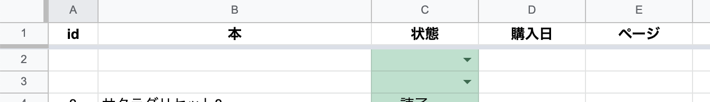

# 使い方
これは実際に公開しないと動かないので、注意してください。
ngrokを使うといいらしいです。
私は全部herokuに上げて逐一動作を確認していました。

## scriptsの中身
### bot.js
基本的なコード

### gas.js
スプシとの連携
本の取得ができる

### post.js
毎朝自動的に投稿するためのもの

herokuでSchedulerとbashのif文を用いて上手くやるとできる

### trello.js
trelloから取得するためのもの
日間のタスクと週間のタスクを取れるようになっている。
ただし、期限をつけていないものについては除外してある


## スプシのgasのサンプル


gasのコード
以下のコードをスクリプトエディタに貼り付けて公開してあげれば動くと思います。
```
function doGet(e) {
  Logger.log(e);
  const spread = SpreadsheetApp.getActive();
  const bookSheet = spread.getSheetByName("Book");
  var bookData = bookSheet.getDataRange().getValues();
  
  let result = {};

  result.book = bookSheet.getRange(2,1, bookData.length-1, 5).getValues();

  var output = ContentService.createTextOutput();
  output.setMimeType(ContentService.MimeType.JSON);
  output.setContent(JSON.stringify({status: 200, data: result}));
  return output;
}

function doPost(e) {
  var json = JSON.parse(e.postData.getDataAsString());
  const spread = SpreadsheetApp.getActiveSpreadsheet();
  const bookSheet = spread.getSheetByName("Book");
  
  var bookData = bookSheet.getDataRange().getValues();
  
  var result = {}
  result.json = json;
  
  if(json.command === "BookStateChange"){
    for(var i=1; i<bookData.length; i++){
      if(bookData[i][1] === json.name){
        bookSheet.getRange(i+1, 3).setValue(json.state);
        result.data = {name:bookData[i][1], state:bookData[i][2]}
      }
    }
  }else if(json.command === "newBook"){
    bookSheet.getRange(bookData.length+1,1,1,5).setValues([
      ["=row()-1", json.name, "積読", json.day, 0]
    ])
  }

  var output = ContentService.createTextOutput();
  output.setMimeType(ContentService.MimeType.JSON);
  output.setContent(JSON.stringify({status: 200, data: result}));
  return output;
}
```


.envファイルに以下のうち必要な内容を書いてください。
```
SLACK_BOT_TOKEN=スラックのTOKEN
SLACK_SIGNING_SECRET=SLACKのSIGNING＿SECRET
url=GOOGLEスプシのURL
key=Trelloのkey
token=TrelloのToken
boardId=TrelloのboardID
```